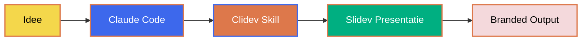
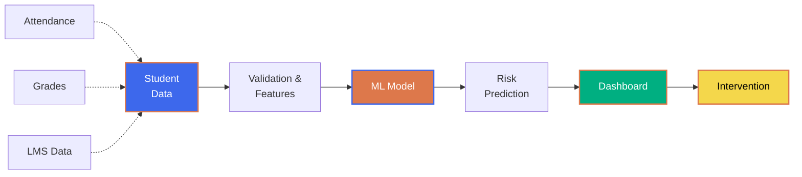

<style>
  /* Npuls Custom Fonts */
  @font-face {
    font-family: 'General Sans';
    src: url('/npuls/Npuls_lettertype/Npuls_lettertype_generalsans_regular.otf') format('opentype');
    font-weight: 400;
    font-style: normal;
  }

  @font-face {
    font-family: 'General Sans';
    src: url('/npuls/Npuls_lettertype/Npuls_lettertype_generalsans_semibold.otf') format('opentype');
    font-weight: 600;
    font-style: normal;
  }

  @font-face {
    font-family: 'Cooper Light BT';
    src: url('/npuls/Npuls_lettertype/Npuls_lettertype_cooper_light_bt.ttf') format('truetype');
    font-weight: 300;
    font-style: normal;
  }

  /* Apply font family to all slides */
  :deep(.slide) {
    font-family: 'General Sans', Arial, Helvetica, sans-serif;
  }

  /* Npuls Branding Colors */
  :root {
    --npuls-blue: #3D68EC;
    --npuls-orange: #DD784B;
    --npuls-green: #00AF81;
    --npuls-yellow: #F4D74B;
    --npuls-pink: #F4D9DC;
    --npuls-black: #000000;
    --npuls-white: #FFFFFF;
  }

  /* AGGRESSIVE OVERLAY REMOVAL - CRITICAL */
  * {
    box-shadow: none !important;
  }

  #slide-content,
  .slidev-layout,
  .slide-container,
  [class*="slide"],
  [id*="slide"] {
    background-color: transparent !important;
    box-shadow: none !important;
    filter: none !important;
  }

  #slide-content::before,
  #slide-content::after,
  .slidev-layout::before,
  .slidev-layout::after,
  .slide-container::before,
  .slide-container::after,
  [class*="slide"]::before,
  [class*="slide"]::after,
  [class*="cover"]::before,
  [class*="cover"]::after,
  [class*="background"]::before,
  [class*="background"]::after {
    display: none !important;
    content: none !important;
    opacity: 0 !important;
  }

  /* Headings met Npuls kleuren */
  :deep(h1) {
    color: #DD784B !important;
    font-weight: 700;
    font-size: 3.5rem;
    line-height: 1.2;
  }

  :deep(h2) {
    color: #DD784B !important;
    font-weight: 600;
    font-size: 2.5rem;
  }

  :deep(h3), :deep(h4), :deep(h5), :deep(h6) {
    color: #000000 !important;
    font-weight: 600;
  }

  /* Subtitle op title slide - Oranje maar NIET bold */
  .title-subtitle {
    color: #DD784B !important;
    font-weight: 400 !important;
    font-size: 1.8rem;
  }

  .title-subtitle strong {
    font-weight: 400 !important;
  }

  /* Links */
  :deep(a) {
    color: #3D68EC;
    text-decoration: none;
    transition: color 0.3s ease;
  }

  :deep(a:hover) {
    color: #DD784B;
  }

  /* Strong/Bold tekst */
  :deep(strong) {
    color: #3D68EC;
    font-weight: 600;
  }

  /* Code blocks met Npuls styling */
  :deep(pre) {
    background-color: #f5f5f5 !important;
    border-left: 4px solid #3D68EC !important;
    padding: 1.5rem !important;
    border-radius: 0.5rem !important;
  }

  :deep(code) {
    font-family: 'Fira Code', monospace !important;
    color: #3D68EC !important;
  }

  /* Npuls Logo on every slide */
  :deep(.slide)::after {
    content: '';
    position: absolute;
    bottom: 1.2rem;
    right: 1.2rem;
    width: 85px;
    height: auto;
    aspect-ratio: 3/1;
    background-image: url('/npuls/npuls_logo.jpg');
    background-size: contain;
    background-repeat: no-repeat;
    opacity: 0.9;
    z-index: 100;
  }

  /* Apple-style animations */
  @keyframes fadeInUp {
    from {
      opacity: 0;
      transform: translateY(30px);
    }
    to {
      opacity: 1;
      transform: translateY(0);
    }
  }

  @keyframes scaleIn {
    from {
      opacity: 0;
      transform: scale(0.9);
    }
    to {
      opacity: 1;
      transform: scale(1);
    }
  }

  .animate-fade-in-up {
    animation: fadeInUp 0.8s ease-out;
  }

  .animate-scale-in {
    animation: scaleIn 0.6s ease-out;
  }

  /* Bullet points styling */
  :deep(ul) {
    list-style: none;
    padding-left: 0;
  }

  :deep(li) {
    padding-left: 2rem;
    position: relative;
    margin-bottom: 1rem;
    font-size: 1.3rem;
    line-height: 1.6;
  }

  :deep(li::before) {
    content: '●';
    color: #3D68EC;
    font-size: 1.5rem;
    position: absolute;
    left: 0;
  }

  /* Big impact text */
  .big-impact {
    font-size: 4rem;
    font-weight: 700;
    color: #DD784B;
    line-height: 1.1;
    text-align: center;
  }

  .medium-impact {
    font-size: 2.5rem;
    font-weight: 600;
    color: #3D68EC;
    text-align: center;
  }

  /* Illustration opacity override */
  img[src*="powerpoint_illustrations"] {
    opacity: 1 !important;
  }

  img[src*="powerpoint_illustrations"] * {
    opacity: 1 !important;
  }

  /* Grid layouts */
  .two-column {
    display: grid;
    grid-template-columns: 1fr 1fr;
    gap: 3rem;
    align-items: center;
  }

  /* Highlight box */
  .highlight-box {
    background: linear-gradient(135deg, #3D68EC 0%, #DD784B 100%);
    padding: 2rem;
    border-radius: 1rem;
    color: white;
    text-align: center;
  }

  .highlight-box h3 {
    color: white !important;
    margin-bottom: 1rem;
  }
</style>

<div style="position: absolute; top: 0; left: 0; width: 100%; height: 100%; z-index: -1;">
  
</div>

<div class="animate-scale-in">

<h1 style="color: #DD784B;">Clidev</h1>

<h2 style="color: #DD784B;">Van idee naar presentatie in minuten</h2>

<div class="mt-6 text-2xl" style="color: #3D68EC; line-height: 1.6;">

AI-powered presentaties met **automatische branding**

</div>

<div style="margin-top: 3rem; color: #666; font-size: 1rem;">
Presentatie door <strong style="color: #3D68EC;">CEDA</strong> - Centre for Educational Data Analytics
</div>

</div>

<!--
⏱️ Timing: 30 seconden

📌 Key points:
- Welkom kort en krachtig
- Introductie van Clidev concept
- "Van idee naar presentatie in minuten"

🔄 Transitie:
"Laten we beginnen met wat Clidev precies is..."
-->

---

<div style="position: absolute; top: 0; left: 0; width: 100%; height: 100%; z-index: -1;">
  
</div>

<div style="margin-left: 50%; padding-left: 2rem;">

# Agenda

<div class="mt-4 text-xl" style="line-height: 1.6;">

- Wat is Clidev
- Waarom Clidev gebruiken
- Technische features
- Live demo
- Aan de slag
</div>

</div>

<!--
⏱️ Timing: 1 minuut

📌 Key points:
- Agenda direct zichtbaar
- 5 hoofdonderwerpen

🔄 Transitie:
"Eerst kijken we naar wat Clidev is..."
-->

---

<div style="position: absolute; top: 0; left: 0; width: 100%; height: 100%; z-index: -1;">
  
</div>

# Wat is Clidev?

<div class="mt-4">

### Een combinatie van tools

- **Claude Code** - AI-assistent voor developers
- **Slidev** - Presentation slides voor developers
- **Automatische branding** - Npuls huisstijl out-of-the-box

### Het resultaat

Van tekstuele instructie naar **professionele presentatie met branding** in seconden
</div>


<!--
⏱️ Timing: 2 minuten

📌 Key points:
- Claude Code + Slidev combinatie
- Automatische branding is de killer feature
- Van idee naar branded presentatie

💡 Extra context:
"Claude Code is de CLI tool van Anthropic, Slidev is een developer-first presentation tool"

🔄 Transitie:
"Laten we kijken naar de workflow..."
-->

---

<div style="position: absolute; top: 0; left: 0; width: 100%; height: 100%; z-index: -1;">
  
</div>

# Clidev = Claude + Slidev

<div class="mt-4">

<div class="grid grid-cols-3 gap-6 mt-4" style="align-items: center; text-align: center;">

<div>

<div style="font-size: 5rem; margin-bottom: 1rem;">🤖</div>

<div style="font-size: 1.5rem; font-weight: 600; color: #3D68EC;">Claude</div>

<div style="font-size: 0.9rem; margin-top: 0.5rem;">AI Assistant</div>

</div>

<div style="font-size: 3rem; color: #DD784B; font-weight: 700;">

+

</div>

<div>

<div style="font-size: 5rem; margin-bottom: 1rem;">📊</div>

<div style="font-size: 1.5rem; font-weight: 600; color: #00AF81;">Slidev</div>

<div style="font-size: 0.9rem; margin-top: 0.5rem;">Dev Presentations</div>

</div>

</div>

<div class="mt-4" style="text-align: center;">

<div style="font-size: 2.5rem; color: #DD784B; font-weight: 700; margin-top: 2rem;">

= Clidev

</div>

<div style="font-size: 1.2rem; color: #3D68EC; margin-top: 1rem;">

AI-powered presentaties met automatische branding

</div>

</div>

</div>

<!--
⏱️ Timing: 1 minuut

📌 Key points:
- Visual representation Claude + Slidev
- Content direct zichtbaars
- Laat de combinatie zien

🔄 Transitie:
"Laten we kijken hoe deze combinatie werkt..."
-->

---

<div style="position: absolute; top: 0; left: 0; width: 100%; height: 100%; z-index: -1;">
  
</div>

# Workflow in actie



### Van concept naar presentatie

- Stap 1: Je beschrijft wat je wilt presenteren
- Stap 2: Claude genereert de complete presentatie
- Stap 3: Npuls branding wordt automatisch toegepast
- Stap 4: Je opent en presenteert
<!--
⏱️ Timing: 2 minuten

📌 Key points:
- Mermaid diagram laat workflow zien
- 4 simpele stappen
- Automatisering is de kracht

💡 Demo tip:
"Straks zien we dit live in actie"

🔄 Transitie:
"Maar waarom zou je Clidev gebruiken?"
-->

---
class: text-center
---

<div style="position: absolute; top: 0; left: 0; width: 100%; height: 100%; z-index: -1;">
  
</div>

<div style="font-weight: 700; font-size: 3.5rem; color: #FFFFFF;">

# Waarom Clidev?

</div>

<div style="font-weight: 600; font-size: 2rem; margin-top: 1rem; color: #FFFFFF;">

## De voordelen op een rij

</div>

<!--
⏱️ Timing: 10 seconden

📌 Key points:
- Chapter slide met sterke visual
- Transitie naar voordelen sectie

🔄 Transitie:
"Laten we kijken naar de belangrijkste voordelen..."
-->

---

<div style="position: absolute; top: 0; left: 0; width: 100%; height: 100%; z-index: -1;">
  
</div>

# Snelheid ⚡

<div class="two-column mt-8">

<div>

### Traditioneel

- Template zoeken
- Content schrijven
- Branding toepassen
- Layout aanpassen
- Itereren en verfijnen

**Tijdsinvestering: 2-4 uur**

</div>

<div>

### Met Clidev

- Beschrijf je idee
- Claude genereert presentatie
- Klaar!

**Tijdsinvestering: 2-5 minuten**

</div>

</div>


<!--
⏱️ Timing: 2 minuten

📌 Key points:
- Twee-kolommen vergelijking
- Drastisch tijdsverschil (uren vs minuten)
- v-click voor progressive reveal

💡 Benadrukt:
"Van uren naar minuten - dat is de kracht van automatisering"

🔄 Transitie:
"En snelheid is niet het enige voordeel..."
-->

---

<div style="position: absolute; top: 0; left: 0; width: 100%; height: 100%; z-index: -1;">
  
</div>

# Consistente Branding 🎨

<div class="mt-6">

### Automatisch toegepast

- **Npuls kleuren** - Blauw, oranje, groen uit huisstijl
- **Custom fonts** - General Sans en Cooper Light BT
- **Logo placement** - Rechtsonder op elke slide
- **Background slides** - Slide1.PNG t/m Slide17.PNG
<div class="mt-8">

### Het resultaat

Elke presentatie volgt de <span v-mark="{ at: '+1', type: 'circle', color: '#DD784B' }">**Npuls huisstijl**</span> perfect

</div>

</div>


<!--
⏱️ Timing: 2 minuten

📌 Key points:
- v-mark.circle.orange voor emphasis op "Npuls huisstijl"
- Alle branding elementen worden automatisch toegepast
- Consistentie over alle presentaties

💡 Extra context:
"Je hoeft nooit meer te checken of je de juiste kleuren gebruikt"

🔄 Transitie:
"En er is nog meer..."
-->

---

<div style="position: absolute; top: 0; left: 0; width: 100%; height: 100%; z-index: -1;">
  
</div>

# Git Integratie 🔄

<div class="mt-4">

### Presentaties als code

- **Markdown format** - Plain text, easy to diff
- **Version control** - Track changes met git
- **Collaboration** - Pull requests voor presentaties
</div>

<div class="mt-4">

### Workflow

```bash
# Maak presentatie
slidev new presentation.md
```

```bash
# Git workflow
git checkout -b feature/new-slides
git add presentation.md && git commit -m "Add slides"
git push origin feature/new-slides
```

```bash
# Pull request
gh pr create --title "New slides for Q1"
```
</div>

<!--
⏱️ Timing: 3 minuten

📌 Key points:
- Magic Move animatie voor code progressie
- Git workflow voor presentaties
- Collaboration zoals je gewend bent

💡 Benadrukt:
"Presentaties worden development artifacts - met alle voordelen"

🔄 Transitie:
"Nog een belangrijk voordeel..."
-->

---

<div style="position: absolute; top: 0; left: 0; width: 100%; height: 100%; z-index: -1;">
  
</div>

# Developer-Vriendelijk 👨‍💻

<div class="mt-4">

### Waarom developers Slidev kiezen

- **Markdown syntax** - Schrijf zoals je gewend bent
- **Code highlighting** - Automatische syntax highlighting
- **Hot reload** - Live preview tijdens ontwikkelen
- **Diagrams & formulas** - Mermaid, LaTeX support
- **Git-friendly** - Versie controle
</div>

<div class="mt-4">

### Code highlighting voorbeeld

```python {1|3-5|7|all}
import pandas as pd

# Load student data
df = pd.read_csv('students.csv')
df = df.dropna()

results = df.groupby('cohort').mean()
```

</div>

<!--
⏱️ Timing: 3 minuten

📌 Key points:
- Simplified structure for working v-clicks
- Click-based code highlighting {1|3-5|7|all}
- Developer tools die je al kent

💡 Demo tip:
"Laat de progressive code highlighting zien"

🔄 Transitie:
"Nu naar de technische features..."
-->

---
class: text-center
---

<div style="position: absolute; top: 0; left: 0; width: 100%; height: 100%; z-index: -1;">
  
</div>

<div style="font-weight: 700; font-size: 3.5rem; color: #FFFFFF;">

# Technische Features

</div>

<div style="font-weight: 600; font-size: 2rem; margin-top: 1rem; color: #FFFFFF;">

## Wat kan Clidev allemaal?

</div>

<!--
⏱️ Timing: 10 seconden

📌 Key points:
- Chapter slide voor technische sectie
- Wissel Slide13/14/15 af voor variatie

🔄 Transitie:
"Slidev heeft veel krachtige features..."
-->


---

<div style="position: absolute; top: 0; left: 0; width: 100%; height: 100%; z-index: -1;">
  
</div>

# De Kracht van Clidev

<div class="mt-3">

<div class="grid grid-cols-2 gap-8 mt-6" style="align-items: start;">

<div>

<div style="text-align: center;">

### Claude Code 🤖

**AI-powered development**

<div style="font-size: 0.9rem; margin-top: 0.75rem;">

- Genereert content
- Begrijpt context
- Automatiseert workflow
- Schrijft code in jouw stijl

</div>

</div>

</div>

<div>

<div style="text-align: center;">

### Slidev 📊

**Developer-first presentaties**

<div style="font-size: 0.9rem; margin-top: 0.75rem;">

- Markdown-based
- Git-friendly
- Code highlighting
- Professional output

</div>

</div>

</div>

</div>

<div class="mt-6" style="text-align: center; font-size: 1.3rem; color: #3D68EC; font-weight: 600;">

→ Samen = **AI-powered presentaties** in minuten

</div>

</div>

<!--
⏱️ Timing: 2 minuten

📌 Key points:
- Claude Code brengt AI intelligence
- Slidev brengt developer workflow
- Combinatie is de kracht
- Focus op de synergy

💡 Benadrukt:
"Het is de combinatie die de magie maakt"

🔄 Transitie:
"Hoe werkt deze combinatie in de praktijk?"
-->

---

<div style="position: absolute; top: 0; left: 0; width: 100%; height: 100%; z-index: -1;">
  
</div>

# AI-Powered Workflow

<div class="mt-2" style="font-size: 0.85rem; line-height: 1.5;">

**Stap 1: Jij beschrijft** → `"Maak presentatie over student analytics Q4"`

**Stap 2: Claude begrijpt** → CEDA context + Npuls huisstijl

**Stap 3: Claude genereert** → Markdown + branding + diagrammen

**Stap 4: Slidev genereert** → Professional output + PDF export

**Iteratief verfijnen** 🔄 → "Voeg slide toe", "Pas kleuren aan" → Claude past direct aan

</div>

<div class="mt-2" style="background: #f5f5f5; padding: 0.6rem; border-radius: 0.5rem; border-left: 4px solid #00AF81; font-size: 0.8rem;">
<strong>Het proces is iteratief:</strong> Niet tevreden? Vraag aanpassingen en Claude verfijnt direct.
</div>

<!--
⏱️ Timing: 3 minuten

📌 Key points:
- Natuurlijke taal als input
- AI doet het zware werk
- Professional output
- Iteratief proces: blijf verfijnen tot perfect
- Geen handmatig design werk

🔄 Transitie:
"En er is nog een krachtige use case..."
-->

---

<div style="position: absolute; top: 0; left: 0; width: 100%; height: 100%; z-index: -1;">
  
</div>

# Git Integratie Use Case

<div class="mt-2" style="font-size: 0.85rem; line-height: 1.5;">

**Scenario:** Stakeholder review Q3 2025 → Q1 2026

**Claude analyseert:**

```bash
git log --since="2025-09-01" --until="2026-03-31"
gh pr list --state merged --search "merged:2025-09-01..2026-03-31"
```

**Resultaat:** Presentatie met nieuwe features, wijzigingen, code voorbeelden

</div>

<div class="mt-2" style="background: linear-gradient(135deg, #3D68EC, #00AF81); padding: 0.6rem; border-radius: 0.5rem; color: white; font-size: 0.85rem; text-align: center;">
<strong>Van 4 uur handmatig werk → 2 minuten met Claude</strong>
</div>

<!--
⏱️ Timing: 2 minuten

📌 Key points:
- Claude gebruikt git en gh commands
- Analyseert wijzigingen tussen twee momenten
- Genereert automatisch presentatie
- Enorme tijdsbesparing voor stakeholder updates

💡 Benadrukt:
"Dit is perfect voor regelmatige stakeholder reviews"

🔄 Transitie:
"Maar hoe werkt dit technisch?"
-->

---

<div style="position: absolute; top: 0; left: 0; width: 100%; height: 100%; z-index: -1;">
  
</div>

# Hoe Clidev Werkt

<div class="mt-2" style="font-size: 0.85rem; line-height: 1.5;">

<div class="grid grid-cols-2 gap-4">

<div>

**1. `/slidev` skill** 📚
- Core Slidev kennis
- Syntax & features
- Layouts & componenten

**Bron:** [sli.dev](https://sli.dev)

</div>

<div>

**2. `CLAUDE.md`** 🎨
- Npuls branding
- CEDA workflows
- Spacing regels

**Bron:** Project repository

</div>

</div>

<div class="mt-2" style="background: #f5f5f5; padding: 0.6rem; border-radius: 0.5rem; border-left: 4px solid #3D68EC; font-size: 0.8rem;">
`/slidev` skill = Foundation (wat Slidev kan)<br>
`CLAUDE.md` = Customization (hoe CEDA het gebruikt)
</div>

</div>

<!--
⏱️ Timing: 2 minuten

📌 Key points:
- Twee kennisbronnen uitgelegd
- /slidev skill = core knowledge
- CLAUDE.md = Npuls specifics
- Hiërarchie duidelijk gemaakt

💡 Benadrukt:
"Deze combinatie zorgt voor automatische branding"

🔄 Transitie:
"Dit levert concrete voordelen op..."
-->

---

<div style="position: absolute; top: 0; left: 0; width: 100%; height: 100%; z-index: -1;">
  
</div>

# De Concrete Voordelen

<div class="mt-2">

<div class="grid grid-cols-2 gap-6 mt-4">

<div>

### ⚡ Tijdsbesparing

<div style="font-size: 0.9rem; line-height: 1.5;">

- **Was**: 2-4 uur
- **Nu**: 2-5 minuten
- **Besparing**: 95%+ tijd

</div>

<div class="mt-3" style="background: linear-gradient(135deg, #3D68EC, #DD784B); padding: 1rem; border-radius: 0.5rem; color: white; font-size: 0.9rem;">
<strong>10 presentaties/jaar =</strong><br>
<strong style="font-size: 1.2rem;">30+ uur bespaard</strong>
</div>

</div>

<div>

### ✅ Kwaliteitsgarantie

<div style="font-size: 0.9rem; line-height: 1.5;">

- Correcte Npuls branding
- Consistente styling
- Geen design fouten
- Professional output

</div>

<div class="mt-3" style="background: linear-gradient(135deg, #00AF81, #3D68EC); padding: 1rem; border-radius: 0.5rem; color: white; font-size: 0.9rem;">
<strong>Minder revisies =</strong><br>
<strong style="font-size: 1.2rem;">Sneller klaar</strong>
</div>

</div>

</div>

<div class="mt-4" style="font-size: 1.1rem;">

### 🎯 Focus op inhoud, niet vorm

</div>

</div>

<!--
⏱️ Timing: 2 minuten

📌 Key points:
- Concrete cijfers over tijdsbesparing
- ROI voor organisatie
- Focus shift naar content

💡 Benadrukt:
"30+ uur per jaar is bijna een werkweek!"

🔄 Transitie:
"Wanneer zou je Clidev gebruiken?"
-->

---
class: text-center
---

<div style="position: absolute; top: 0; left: 0; width: 100%; height: 100%; z-index: -1;">
  
</div>

<div style="font-weight: 700; font-size: 3.5rem; color: #FFFFFF;">

# Use Cases

</div>

<div style="font-weight: 600; font-size: 2rem; margin-top: 1rem; color: #FFFFFF;">

## Wanneer Clidev gebruiken?

</div>

<!--
⏱️ Timing: 10 seconden

📌 Key points:
- Chapter slide voor use cases
- Wissel Slide backgrounds af

🔄 Transitie:
"Laten we kijken naar praktische toepassingen..."
-->

---

<div style="position: absolute; top: 0; left: 0; width: 100%; height: 100%; z-index: -1;">
  
</div>

# Ideale Situaties

<div class="mt-4">

<div class="grid grid-cols-2 gap-6 mt-6">

<div>

<div class="highlight-box" style="padding: 1rem;">

### Snelle Updates

Stakeholder presentaties met laatste cijfers

</div>

</div>

<div>

<div class="highlight-box" style="padding: 1rem;">

### Technische Demos

Code reviews, architecture discussions

</div>

</div>

<div>

<div class="highlight-box" style="padding: 1rem;">

### Workshops

Interactive coding sessions

</div>

</div>

<div>

<div class="highlight-box" style="padding: 1rem;">

### Data Rapportages

Analysis resultaten en dashboards

</div>

</div>

</div>

</div>

<!--
⏱️ Timing: 1.5 minuten

📌 Key points:
- 4 belangrijkste use cases
- Content direct zichtbaar
- Gradient boxes voor visual appeal

💡 Vraag:
"Wie herkent deze situaties?"

🔄 Transitie:
"Laten we een CEDA voorbeeld bekijken..."
-->

---

<div style="position: absolute; top: 0; left: 0; width: 100%; height: 100%; z-index: -1;">
  
</div>

# CEDA Voorbeeld

<div class="mt-2">

### Student Success Analytics Dashboard



</div>

<!--
⏱️ Timing: 2 minuten

📌 Key points:
- CEDA-specifiek voorbeeld
- Complex Mermaid diagram
- Laat praktische toepassing zien

🔄 Transitie:
"Tijd voor een live demo..."
-->

---
class: text-center
---

<div style="position: absolute; top: 0; left: 0; width: 100%; height: 100%; z-index: -1;">
  
</div>

<div style="font-weight: 700; font-size: 4rem; color: #FFFFFF;" class="animate-scale-in">

# Live Demo

</div>

<div style="font-weight: 600; font-size: 2rem; margin-top: 1rem; color: #FFFFFF;">

## Van idee naar presentatie

</div>

<!--
⏱️ Timing: 5-10 minuten (live demo)

📌 Demo stappen:
1. Open Claude Code
2. Beschrijf een presentatie idee
3. Laat Clidev skill runnen
4. Open gegenereerde presentatie in Slidev
5. Laat verschillende features zien

💡 Demo tips:
- Gebruik een relevant onderwerp (bijv. data analysis)
- Laat hot reload zien
- Laat presenter mode zien
- Edit live een slide

🔄 Transitie:
"Nu jullie het gezien hebben, laten we kijken hoe je ermee aan de slag kunt..."
-->

---

<div style="position: absolute; top: 0; left: 0; width: 100%; height: 100%; z-index: -1;">
  
</div>

# Aan de Slag

<div class="mt-4" style="font-size: 0.95rem;">

**Stap 1: Installeer Slidev**
```bash
npm install -g @slidev/cli
```

**Stap 2: Vraag Claude**
```
"Maak presentatie over [onderwerp]"
```

**Stap 3: Start & presenteer**
```bash
slidev presentation.md --open
```

Druk `F` voor fullscreen, `P` voor presenter mode
</div>

<!--
⏱️ Timing: 2 minuten

📌 Key points:
- 4 simpele stappen
- Progressive reveal
- Code snippets voor copy-paste

💡 Extra:
"Documentatie staat in CLAUDE.md"

🔄 Transitie:
"Laten we afronden..."
-->

---

<div style="position: absolute; top: 0; left: 0; width: 100%; height: 100%; z-index: -1;">
  
</div>

# Samenvatting

<div class="mt-6">

### Wat hebben we geleerd?

- **Clidev** = Claude Code + Slidev combinatie
- **AI-powered workflow** van idee naar presentatie
- **95% tijdsbesparing** (uren naar minuten)
- **Automatische branding** altijd correct
- **Focus op inhoud** niet op vorm

### Het resultaat

<div class="mt-4 big-impact" style="font-size: 3rem;">

Professionele presentaties in minuten

</div>
</div>

<!--
⏱️ Timing: 2 minuten

📌 Key points:
- Recap van alle belangrijke punten
- Big impact finale statement
- Progressive reveal

💡 Slotopmerkingen:
"Probeer het zelf en ervaar het verschil"

🔄 Transitie:
"Bedankt voor jullie aandacht!"
-->

---

<div style="position: absolute; top: 0; left: 0; width: 100%; height: 100%; z-index: -1;">
  
</div>

# Resources & Links

<div class="mt-4 text-xl" style="line-height: 1.7;">

**Documentatie**

- [Slidev Documentation](https://sli.dev)
- [Claude Code](https://claude.com/claude-code)
- CLAUDE.md in dit project

**CEDA**

- Website: [npuls.nl/ceda](https://npuls.nl/ceda)
- Email: ceda@npuls.nl

**Deze presentatie**

- Repository: Contact CEDA voor toegang
- Vragen? Stel ze nu!
</div>

<!--
⏱️ Timing: 1 minuut

📌 Key points:
- Links naar resources
- Contact informatie
- Q&A opening

💡 Afsluiting:
"Zijn er vragen?"
-->

---

<div style="position: absolute; top: 0; left: 0; width: 100%; height: 100%; z-index: -1;">
  
</div>

# Gepresenteerd door

<div class="mt-4" style="text-align: center;">


<h2 style="margin-top: 1.5rem; font-size: 2rem; color: #DD784B;">Aslam Tanjung</h2>

<p style="margin-top: 0.5rem; font-size: 1.2rem; color: #3D68EC; font-weight: 600;">Data Scientist @ CEDA</p>

<div style="margin-top: 1.5rem; font-size: 1rem; line-height: 1.6; max-width: 600px; margin-left: auto; margin-right: auto;">
Centre for Educational Data Analytics
</div>

<div style="margin-top: 1rem; font-size: 0.9rem; color: #666;">
📧 aslam.tanjung@npuls.nl
</div>

</div>

<!--
⏱️ Timing: 30 seconden

📌 Key points:
- Presenter slide met foto
- Contact informatie
- Professional afsluiting

🔄 Transitie:
"Vragen? Neem contact op!"
-->

---
class: text-center
---

<div style="position: absolute; top: 0; left: 0; width: 100%; height: 100%; z-index: -1;">
  
</div>

<!--
⏱️ Timing: Finale slide - geen tijd

📌 Key points:
- Geen tekst op Slide17.PNG (zoals per guidelines)
- Einde van presentatie
- Perfect voor Q&A of networking

💡 Gebruik:
Laat deze slide zien tijdens Q&A of na afloop
-->
