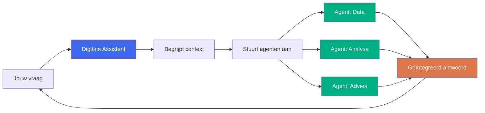

  

# CEDAssistentie

## Digitale assistentie voor het onderwijs van overmorgen

<strong>CEDA</strong> - Centre for Educational Data Analytics

<!--
⏱️ Timing: 1 min
📌 Key points:
- Eerste introductie van CEDAssistentie
- Focus op visie en toekomst
- Maak het enthousiasmerend
💡 Context: Dit is baanbrekend project voor MBO onderwijs

📝 SCRIPT:
"Welkom allemaal. Vandaag nemen we je mee naar de toekomst van het onderwijs. We gaan het hebben over CEDAssistentie - digitale assistentie voor het onderwijs van overmorgen. Dit is een project van CEDA, het Centre for Educational Data Analytics, waar we geloven dat technologie onderwijs slimmer, toegankelijker en menselijker kan maken. En wat je vandaag gaat zien, is iets waar je waarschijnlijk nog niet eerder mee gewerkt hebt."
-->

---

  

# De uitdaging van vandaag

<v-clicks>

- **Onderwijsprofessionals** worden overspoeld door handmatig werk
- **Data** is beschikbaar, maar **inzichten** blijven verborgen
- **Beslissingen** moeten sneller, maar de basis ontbreekt
- **Ontwikkeling** van lerenden vraagt om persoonlijke aandacht

</v-clicks>

<strong>De vraag:</strong> Hoe kunnen we professionals ondersteunen zonder hen te overspoelen?

<!--
⏱️ Timing: 1.5 min
📌 Key points: Schets het probleem zonder te negativistisch te zijn
💡 Context: Laat zien dat we de uitdaging begrijpen

📝 SCRIPT:
"Maar eerst: wat is eigenlijk de uitdaging waar we voor staan? Onderwijsprofessionals worden overspoeld door handmatig werk. Rapporten maken, data invoeren, analyses draaien - het kost enorm veel tijd. En tegelijkertijd: we hebben meer data dan ooit, maar de échte inzichten blijven vaak verborgen tussen de spreadsheets. Beslissingen moeten steeds sneller, maar de basis om die beslissingen op te nemen ontbreekt vaak. En wat we eigenlijk willen - persoonlijke aandacht geven aan de ontwikkeling van onze lerenden - daar komt vaak te weinig tijd voor over. De vraag die centraal staat: hoe kunnen we professionals ondersteunen zonder hen nóg meer te overspoelen met tools en systemen?"
-->

---

  

# Wat als...

<v-clicks>

**Je had een assistent die:**
- 24/7 beschikbaar is
- In gewone taal communiceert
- Jouw context begrijpt
- Proactief meedenkt

</v-clicks>

<v-clicks>

**Die automatisch:**
- Data analyseert
- Trends signaleert
- Risico's voorspelt
- Handelingsadviezen geeft

</v-clicks>

<strong>Welkom bij de toekomst van digitale assistentie</strong>

<!--
⏱️ Timing: 2 min
📌 Key points: Creëer de visie en wek enthousiasme op
🔄 Transition: Van probleem naar oplossing

📝 SCRIPT:
"Maar stel je nu eens voor... Wat als je een assistent had die 24/7 beschikbaar is? Die je niet hoeft uit te leggen hoe het onderwijssysteem werkt, maar die jouw context al begrijpt. Een assistent waarmee je gewoon in normale taal kunt praten, zonder ingewikkelde software te leren. Een assistent die niet alleen antwoord geeft op je vragen, maar proactief meedenkt. En die automatisch, op de achtergrond, jouw data analyseert. Die trends signaleert voordat jij ze zelf ziet. Die risico's voorspelt voordat ze problemen worden. En die concrete handelingsadviezen geeft die je meteen kunt gebruiken. Dit klinkt misschien als sciencefiction, maar welkom bij de toekomst van digitale assistentie - en die toekomst is dichterbij dan je denkt."
-->

---
class: text-center
---

  

# CEDAssistentie

Altijd beschikbare, maatschappelijk aanvaardbare, kwalitatieve en betrouwbare digitale assistentie

<!--
⏱️ Timing: 30 sec
📌 Key points: Chapter divider, laat de naam en visie landen

📝 SCRIPT:
"CEDAssistentie. Altijd beschikbare, maatschappelijk aanvaardbare, kwalitatieve en betrouwbare digitale assistentie. Laat deze woorden even landen."
-->

---

  

# Wat is CEDAssistentie?

<strong>Digitale assistentie van de nieuwe generatie</strong> - Een samenwerkend ecosysteem van AI-technologie speciaal ontwikkeld voor het MBO onderwijs

<strong>🗣️ Digitale Assistent</strong> 
Je persoonlijke gesprekspartner die je vraag begrijpt en vertaalt naar actie

<strong>🤖 Autonome Agenten</strong> 
Gespecialiseerde achtergrondwerkers die zelfstandig taken uitvoeren

<!--
⏱️ Timing: 2 min
📌 Key points: Leg uit wat het is op een begrijpelijke manier
💡 Context: Niet te technisch, focus op samenwerking

📝 SCRIPT:
"Wat is CEDAssistentie precies? Het is digitale assistentie van een hele nieuwe generatie. We praten hier over een samenwerkend ecosysteem van AI-technologie, speciaal ontwikkeld voor het MBO onderwijs. En het bestaat uit twee onderdelen die naadloos samenwerken. Aan de ene kant heb je de digitale assistent - dat is jouw persoonlijke gesprekspartner. Je stelt een vraag, de assistent begrijpt wat je bedoelt en vertaalt dat naar actie. Aan de andere kant draaien er op de achtergrond autonome agenten - gespecialiseerde achtergrondwerkers die zelfstandig taken uitvoeren. Data ophalen, analyses draaien, patronen herkennen. En het mooie is: jij merkt daar niets van. Jij praat gewoon met je assistent, en die orkestreert al die agenten voor je."
-->

---

  

# Hoe werkt het?

<strong>In gewone taal:</strong> Je stelt een vraag, de assistent coördineert meerdere agenten op de achtergrond, en je krijgt een compleet antwoord terug - net zoals je met een expert zou praten

<!--
⏱️ Timing: 2 min
📌 Key points: Visualiseer het proces, maak het concreet
💡 Context: Gebruik Mermaid voor visuele impact

📝 SCRIPT:
"Laat me het proces even visualiseren. Je stelt een vraag aan de digitale assistent. Die begrijpt de context - wat bedoel je precies, wat heb je nodig, wat is relevant voor jouw situatie. Vervolgens stuurt de assistent verschillende gespecialiseerde agenten aan. Een agent haalt de juiste data op. Een andere doet de analyse. Weer een andere genereert een handelingsadvies. Al die resultaten komen samen in één geïntegreerd antwoord dat je terugkrijgt. En hier is het punt: in gewone taal betekent dit gewoon dat je een vraag stelt, de assistent coördineert alles op de achtergrond, en je krijgt een compleet antwoord terug - net zoals je met een expert zou praten. Simpel, maar krachtig."
-->

---

  

# Voor wie?

<strong>Onderwijsprofessionals in het MBO</strong> die werken aan de ontwikkeling van (leven-lang-)lerenden

📊

<strong>Strategisch</strong> 
Beleidsmakers, directie

📈

<strong>Tactisch</strong> 
Teamleiders, coördinatoren

👥

<strong>Operationeel</strong> 
Docenten, begeleiders

<!--
⏱️ Timing: 1.5 min
📌 Key points: Duidelijk maken voor wie dit is
💡 Context: Breed toepassingsgebied

📝 SCRIPT:
"Voor wie is dit bedoeld? We richten ons op onderwijsprofessionals in het MBO die werken aan de ontwikkeling van leven-lang-lerenden. En dat is breed. Op strategisch niveau: beleidsmakers en directie die langetermijnbeslissingen nemen over de koers van de instelling. Op tactisch niveau: teamleiders en coördinatoren die operationele plannen maken en teams aansturen. En op operationeel niveau: docenten en begeleiders die dagelijks met lerenden werken. Voor al deze professionals kan CEDAssistentie een game-changer zijn."
-->

---

  

# Wat kan het doen?

<v-clicks>

- **Data begrijpen**: Automatisch opschonen, analyseren en visualiseren
- **Trends herkennen**: Zonder handmatig te verversen, altijd actueel
- **Risico's signaleren**: Voordat problemen zichtbaar worden
- **Adviezen geven**: Evidence-informed handelingsadviezen

</v-clicks>

<strong>Voorbeelden:</strong> 
Cohortanalyses, capaciteitsplanning, uitvalrisico's, interventie-effecten

<strong>Resultaat:</strong> 
Betere beslissingen, sneller schakelen, meer tijd voor wat echt telt

<!--
⏱️ Timing: 2 min
📌 Key points: Concrete mogelijkheden zonder te technisch te worden
💡 Context: Focus op waarde voor gebruiker

📝 SCRIPT:
"Wat kan het doen? Laat me concreet worden. Ten eerste: data begrijpen. De assistent kan automatisch je data opschonen, analyseren en visualiseren. Geen handmatig geploeter meer met Excel. Ten tweede: trends herkennen. En niet alleen herkennen - de assistent monitort continu, zonder dat jij handmatig hoeft te verversen. Het is altijd actueel. Ten derde: risico's signaleren, voordat problemen zichtbaar worden. Stel je voor dat je een melding krijgt: 'Deze groep lerenden loopt risico op uitval, dit is waarom, en dit kun je eraan doen.' En ten vierde: adviezen geven. Evidence-informed handelingsadviezen die gebaseerd zijn op data, niet op buikgevoel. Denk aan cohortanalyses, capaciteitsplanning, uitvalrisico's voorspellen, het effect van interventies meten. Het resultaat? Betere beslissingen, sneller kunnen schakelen, en meer tijd voor wat echt telt: de mens achter de data."
-->

---

  

# Waarom nu?

<v-clicks>

**Technologie is klaar:**
- AI ontwikkelt snel
- Van reactief naar proactief
- Betrouwbaar en schaalbaar

</v-clicks>

<v-clicks>

**Onderwijs heeft het nodig:**
- Toenemende complexiteit
- Meer data, minder tijd
- Hogere verwachtingen

</v-clicks>

<strong>Digitale assistentie evolueert van 'nice to have' naar 'must have'</strong>

<!--
⏱️ Timing: 1.5 min
📌 Key points: Urgentie en momentum
💡 Context: Waarom we dit NU doen

📝 SCRIPT:
"Maar waarom nu? Waarom is dit het moment? Twee redenen. Eén: de technologie is klaar. AI ontwikkelt zich razendsnel. We gaan van reactieve systemen naar proactieve assistentie. De technologie is betrouwbaar geworden en schaalbaar. En twee: het onderwijs heeft het nodig. De complexiteit neemt alleen maar toe. We hebben meer data dan ooit, maar minder tijd om ermee te werken. De verwachtingen van lerenden, van inspectie, van de maatschappij worden steeds hoger. Digitale assistentie evolueert van 'nice to have' naar 'must have'. Dit is niet meer de vraag óf, maar wanneer en hoe we dit gaan inzetten."
-->

---

  

# Onze verkenning

We verzamelen gericht bewijs om onzekerheden weg te nemen op drie cruciale aspecten:

<strong>🔧 Technologie</strong> 
Is het haalbaar om dit te bouwen?

<strong>❤️ Wenselijkheid</strong> 
Zien professionals de waarde?

<strong>🏢 Organisatie</strong> 
Kunnen we het goed inrichten?

<!--
⏱️ Timing: 2 min
📌 Key points: We zijn in verkennende fase, evidence-based werken
💡 Context: Transparantie over waar we staan

📝 SCRIPT:
"En waar staan we nu? We zijn eerlijk: we zijn in een verkennende fase. We verzamelen gericht bewijs om onzekerheden weg te nemen op drie cruciale aspecten. Ten eerste: technologie. Is het haalbaar om dit te bouwen? Kunnen we een systeem maken dat echt betrouwbaar is, dat schaalt, dat voldoet aan alle eisen die het onderwijs stelt? Ten tweede: wenselijkheid. Zien onderwijsprofessionals de waarde? Willen ze hiermee werken? Sluit het aan bij hun dagelijkse praktijk? En ten derde: organisatie. Kunnen we het goed inrichten binnen MBO instellingen? Hoe zit het met privacy, met governance, met de organisatorische verandering die nodig is? We pakken dit evidence-based aan. Geen grote beloftes zonder bewijs, maar stap voor stap leren en bouwen."
-->

---

  

# De principes

<v-clicks>

- **Altijd beschikbaar**: 24/7 toegang tot expertise en ondersteuning
- **Maatschappelijk aanvaardbaar**: Ethisch, transparant en privacyvriendelijk
- **Kwalitatief**: Evidence-informed en continu lerend
- **Betrouwbaar**: Voorspelbaar, veilig en controleerbaar

</v-clicks>

<strong>Technologie is nooit neutraal</strong> - daarom ontwerpen we met principes die waarde(n)vol inzetten borgen

<!--
⏱️ Timing: 2 min
📌 Key points: Onze ontwerpprincipes, ethiek en waarden
💡 Context: Belangrijke differentiator

📝 SCRIPT:
"En daarbij houden we vast aan vier belangrijke principes. Eén: altijd beschikbaar. 24/7 toegang tot expertise en ondersteuning, wanneer je het nodig hebt. Twee: maatschappelijk aanvaardbaar. Dit betekent ethisch, transparant en privacyvriendelijk. We nemen privacy serieus. Drie: kwalitatief. Evidence-informed en continu lerend. Het systeem wordt steeds beter, op basis van bewijs, niet op basis van aannames. En vier: betrouwbaar. Voorspelbaar, veilig en controleerbaar. Je moet erop kunnen vertrouwen. En hier is het punt: technologie is nooit neutraal. Daarom ontwerpen we met principes die waardevol inzetten borgen. We willen niet alleen iets bouwen dat werkt, we willen iets bouwen dat goed is."
-->

---
class: text-center
---

  

# De toekomst begint nu

Samen bouwen aan digitale assistentie van overmorgen

<!--
⏱️ Timing: 30 sec
📌 Key points: Transitie naar volgende stap / demo

📝 SCRIPT:
"De toekomst begint nu. En we gaan die toekomst samen bouwen."
-->

---

  

# Volgende stappen

<v-clicks>

1. **Verkenning starten**: Technologie, wenselijkheid, organisatie
2. **Samen ontwerpen**: Met onderwijsprofessionals als co-creators
3. **Snel leren**: Evidence verzamelen en itereren
4. **Schaal opbouwen**: Van prototype naar productie

</v-clicks>

<strong>Wil je meedenken of meedoen?</strong> We zoeken visionaire uitvinders, omdenkende creatievelingen en ruimdenkende regelmakers

<!--
⏱️ Timing: 2 min
📌 Key points: Call to action, betrokkenheid vragen
💡 Context: Eindigen met hoe mensen kunnen meedoen

📝 SCRIPT:
"Wat zijn de volgende stappen? Ten eerste: we starten de verkenning. Technologie, wenselijkheid, organisatie - we gaan het grondig uitzoeken. Ten tweede: we gaan samen ontwerpen. Niet in een ivoren toren, maar met onderwijsprofessionals als co-creators. Jullie weten wat er nodig is, jullie kennen de praktijk. Ten derde: snel leren. We verzamelen evidence, we itereren, we passen aan. En ten vierde: schaal opbouwen. Van prototype naar productie, stap voor stap. En hier komt de vraag: wil je meedenken of meedoen? We zijn op zoek naar visionaire uitvinders die durven te experimenteren met nieuwe technologie. We zoeken omdenkende creatievelingen die frisse perspectieven brengen. En we zoeken ruimdenkende regelmakers die helpen om dit goed te organiseren. Als dat jou aanspreekt, praat met ons."
-->

---

  

# Contact & Meer informatie

<strong>CEDA</strong> - Centre for Educational Data Analytics 
<strong>Project:</strong> CEDAssistentie 
<strong>Repository:</strong> github.com/cedanl/assistentie

<strong>Samen maken we onderwijs slimmer, data wijzer en assistentie menselijker</strong>

<!--
⏱️ Timing: 1 min
📌 Key points: Contact informatie en afsluiting
🔄 Transition: Naar vragen of demo
-->

---
class: text-center
---

  

<!--
⏱️ Timing: -
📌 Key points: Closing slide zonder tekst zoals vereist
-->
