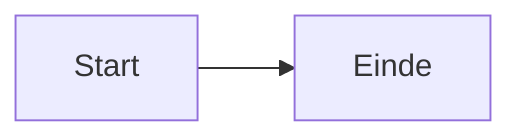

# CEDA Clidev Presentaties

> **FOR CLAUDE CODE:**
> Gebruik `/slidev` skill als basis voor Slidev-kennis.
> Dit bestand = CEDA/Npuls-specifieke regels. Deze hebben voorrang.

---

## Projectstructuur

```
clidev-presentaties/
├── YYMMDD_onderwerp.md          # Presentaties (naamconventie: YYMMDD_onderwerp.md)
├── _template.md                 # Startpunt voor nieuwe presentaties
├── theme/                       # Npuls-thema (fonts, kleuren, logo, overlays)
└── public/
    ├── npuls/
    │   ├── powerpoint_slides/   # Achtergronden (Slide1-19.PNG)
    │   ├── powerpoint_illustrations/  # SVG-iconen
    │   ├── npuls_logo.jpg
    │   └── Npuls_lettertype/    # Lettertypen
    ├── ceda_contributors/       # Teamfoto's
    └── presentations/YYMMDD_onderwerp/  # Presentatiespecifieke bestanden
```

**Naamconventie**: `YYMMDD_onderwerp.md` — bijv. `260311_leeranalytics.md`

---

## Npuls Huisstijl

### Kleuren

| Gebruik | Kleur | Hex |
|---------|-------|-----|
| H1, H2 | Oranje | `#DD784B` |
| H3-H6, body | Zwart | `#000000` |
| Bold, links | Blauw | `#3D68EC` |
| Link hover | Oranje | `#DD784B` |
| Titelslide subtitel | Zwart, niet bold | `.title-subtitle` klasse |
| Accenten | Groen, Geel, Roze | `#00AF81`, `#F4D74B`, `#F4D9DC` |

**CSS-variabelen beschikbaar via thema:** `var(--npuls-blue)`, `var(--npuls-orange)`, `var(--npuls-green)`

**Mermaid-diagrammen:**
- Primaire nodes: `fill:#3D68EC,stroke:#DD784B,color:#fff`
- Belangrijke nodes: `fill:#DD784B,stroke:#3D68EC,color:#fff`
- Succes-nodes: `fill:#00AF81,color:#fff`

### Lettertypen

| Lettertype | Gewicht | Gebruik |
|------------|---------|---------|
| General Sans Regular | 400 | Bodytekst |
| General Sans Semi-Bold | 600 | H1, H2, H3 |
| Cooper Light BT | 300 | Citaten |

### Logo

Verschijnt automatisch rechtsonder op elke slide via het thema. Geen actie nodig.

---

## Thema

Elke presentatie gebruikt `theme: ./theme`. Hierdoor zijn fonts, kleuren, logo en overlay-verwijdering al geregeld. **Geen `<style>` blok nodig in presentatiebestanden.**

Start altijd vanuit `_template.md` — kopieer het bestand en hernoem het.

---

## Achtergronden

**Gebruik altijd de `` methode. Nooit de `background:` eigenschap in frontmatter.**

```html
<!-- CORRECT -->
<div style="position: absolute; top: 0; left: 0; width: 100%; height: 100%; z-index: -1;">
  
</div>
```

| Bestand | Gebruik | Bijzonderheden |
|---------|---------|----------------|
| `Slide1.PNG` | Titelslide | |
| `Slide2.PNG` | Agenda / Over ons | **Tekst RECHTS** (afbeelding links) |
| `Slide3.PNG` | Contentslide | Standaard |
| `Slide13.PNG` / `Slide14.PNG` / `Slide15.PNG` | Hoofdstukdividers | **WITTE tekst verplicht** |
| `Slide17.PNG` | Afsluitslide | **GEEN tekst** |

---

## Illustraties

Controleer altijd de exacte bestandsnaam voor gebruik — hoofdlettergevoelig:

```bash
ls public/npuls/powerpoint_illustrations/ | grep -i "zoekwoord"
```

Gebruik:
```html

```

Veelgemaakte fouten: `Data.svg` → `data.svg` · `Ster.svg` → `Ster geel.svg` · `Boeken.svg` → `Boeken roze blauw.svg`

---

## ⚠️ Spacing & Content Guardrails

**Deze regels voorkomen tekst-overflow. Volg ze zonder uitzondering.**

### Vaste waarden

| Element | Waarde | Nooit meer dan |
|---------|--------|---------------|
| Bovenmarge | `mt-2` | `mt-4` (absoluut maximum) |
| Tussen secties | `mt-2` | `mt-4` |
| Regelafstand | `1.5` | `1.5` |
| Padding (boxes) | `0.75rem` | `0.75rem` |
| Gap (grids) | `gap-4` | `gap-4` |

**Nooit gebruiken:** `mt-6`, `mt-8`, `mt-12` · `line-height: 1.6` of hoger · `padding: 1rem` of hoger in boxes

### Centrering

Content slides gebruiken altijd een gecentreerde wrapper zodat content verticaal gecenterd staat (zoals PowerPoint):

```html
<div style="position: absolute; inset: 0; display: flex; flex-direction: column; justify-content: center; padding: 2rem 4rem; z-index: 1;">

# Slidetitel

<div style="font-size: 0.95rem; line-height: 1.8; margin-top: 1rem;">
  content
</div>
</div>
```

Agendaislide (Slide2.PNG, tekst rechts):

```html
<div style="margin-left: 50%; padding-left: 2rem; height: 100%; display: flex; flex-direction: column; justify-content: center;">
```

### Lettergrootte

| Contenttype | Grootte |
|-------------|---------|
| Bodytekst / lijsten | `0.95rem` |
| Codeblokken | `0.85rem` |
| Boxes / callouts | `0.9rem` |
| H1, H2 | Niet overschrijven (thema regelt dit) |

### Contentlimieten per slide

| Element | Veilig | Absoluut maximum | Overschreden → |
|---------|--------|------------------|----------------|
| Bulletpoints | 3 | 4 | SPLITS IN 2 SLIDES |
| Codeblokken | 1 (4 regels) | 1 (6 regels) | Regels verwijderen of splitsen |
| Secties (###) | 1 | 2 | Splitsen |
| Gridkolommen | 2 | 2 | Max 3 regels per kolom |
| Mermaid-nodes | 5 | 6 | Diagram vereenvoudigen |

**Gouden regel:** Bij twijfel — verwijder content of splits. Te weinig = goed. Te veel = kapotte slide.

### Mermaid

- Scale: `0.5` – `0.6` (nooit hoger dan `0.6`)
- Layout: voorkeur `LR` boven `TD`
- Labels: kort (1-3 woorden)

```markdown

```

### Code highlighting

Code met `{1|2-3|all}` syntax mag **niet** in een `v-click` wrapper zitten — dat breekt de click-progressie.

```markdown
<!-- CORRECT -->
```python {1|3-5|all}
code hier
```

<!-- FOUT -->
<div v-click>
```python {1|3-5|all}
code hier
```
</div>
```

### Grids

Grids zitten altijd binnen de gecentreerde wrapper:

```html
<div style="position: absolute; inset: 0; display: flex; flex-direction: column; justify-content: center; padding: 2rem 4rem; z-index: 1;">

# Slidetitel

<div class="grid grid-cols-2 gap-6" style="font-size: 0.9rem; line-height: 1.7; margin-top: 1rem;">
  <div>Max 3 regels</div>
  <div>Max 3 regels</div>
</div>
</div>
```

### Veelgemaakte fouten

1. "Ziet er goed uit in markdown" → rendered slide is altijd hoger, altijd testen
2. Geen gecentreerde wrapper → content belandt linksboven zonder padding
3. Meer dan 4 bulletpoints → gegarandeerde overflow
4. Mermaid scale > 0.6 → overflow
5. Code in v-click → breekt click-highlighting
6. `mt-4` of groter tussen secties → gebruik `mt-2`

---

## Slide Templates

Kopieer `_template.md` als startpunt. Het bevat werkende voorbeelden van:

- Titelslide (Slide1.PNG)
- Agendaislide (Slide2.PNG, tekst rechts)
- Hoofdstukdivider (Slide13.PNG, witte tekst)
- Contentslide (Slide3.PNG)
- Tweekolommen-layout
- Afsluitslide (Slide17.PNG, geen tekst)

---

## Werkwijze nieuwe presentatie

1. **Vraag de gebruiker:** datum, onderwerp, doelgroep, duur

2. **Maak bestanden aan:**
   ```bash
   cp _template.md YYMMDD_onderwerp.md
   mkdir -p public/presentations/YYMMDD_onderwerp
   ```

3. **Bouw de presentatie:**
   - Pas titelslide aan
   - Voeg contentslides toe (Slide3.PNG)
   - Voeg hoofdstukdividers toe (Slide13/14/15.PNG, witte tekst)
   - Eindig met afsluitslide (Slide17.PNG, geen tekst)
   - Controleer illustratienamen: `ls public/npuls/powerpoint_illustrations/ | grep -i "keyword"`

4. **Test:**
   ```bash
   npx slidev YYMMDD_onderwerp.md --open
   ```

---

## Validatiechecklist

Doorloop dit voor elke slide voor oplevering:

**Structuur:**
- [ ] Bestandsnaam: `YYMMDD_onderwerp.md`
- [ ] Titelslide (Slide1.PNG)
- [ ] Afsluitslide (Slide17.PNG, GEEN tekst)
- [ ] Assetmap aangemaakt: `public/presentations/YYMMDD_onderwerp/`

**Achtergronden:**
- [ ] Alle achtergronden gebruiken `` methode (NIET `background:`)
- [ ] Slide2.PNG heeft tekst RECHTS
- [ ] Hoofdstukslides (Slide13/14/15.PNG) hebben WITTE tekst
- [ ] Slide17.PNG heeft GEEN tekst

**Spacing & content:**
- [ ] Geen `mt-6`, `mt-8`, `mt-12` (alleen `mt-2`, uitzonderlijk `mt-4`)
- [ ] Alle content in `font-size: 0.85rem; line-height: 1.5;` div
- [ ] Max 4 bulletpoints per slide
- [ ] Max 1 codeblok met max 6 regels
- [ ] Mermaid scale ≤ 0.6, nodes ≤ 6
- [ ] Grid: max 3 regels per kolom, gap-4

**Illustraties:**
- [ ] Bestandsnamen hoofdlettergevoelig gecontroleerd met `ls`
- [ ] Geen overlap met content

**Interactie:**
- [ ] Code highlighting NIET in v-click wrapper
- [ ] v-clicks niet genest

**Test:**
- [ ] Elke slide visueel gecontroleerd op overflow
- [ ] Alle clicks doorgelopen
- [ ] Geen 404-fouten voor afbeeldingen

---

## CLI

```bash
npx slidev YYMMDD_onderwerp.md --open    # Dev server (localhost:3030)
npx slidev export YYMMDD_onderwerp.md    # PDF
npx slidev export YYMMDD_onderwerp.md --format pptx
```

Druk op `P` in de browser voor presentatormodus (notities + volgende slide).
