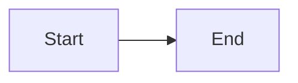

# CEDA Slidev Presentations - Documentation

> **FOR CLAUDE CODE:**
> **ALWAYS use `/slidev` skill as foundation** when working with Slidev presentations.
> This CLAUDE.md = Npuls-specific customizations only.

**Documentation Hierarchy:**
1. `/slidev` skill → Core Slidev (syntax, features, CLI)
2. This CLAUDE.md → Npuls branding + CEDA workflows

---

## Project Structure

```
slidev-presentaties/
├── YYMMDD_name.md              # Presentations (naming: YYMMDD_topic.md)
├── public/
│   ├── npuls/                  # SHARED Npuls assets
│   │   ├── powerpoint_slides/  # Backgrounds (Slide1-19.PNG)
│   │   ├── powerpoint_illustrations/  # 70+ SVG icons
│   │   ├── npuls_logo.jpg
│   │   └── Npuls_lettertype/   # Fonts
│   ├── ceda_contributors/      # Team photos
│   └── presentations/YYMMDD_name/  # Presentation-specific assets
└── snippets/                   # Reusable code
```

**Naming Convention**: `YYMMDD_topic.md` (e.g., `260311_1cijferho_update.md`)

---

## Npuls Branding

### Colors

| Usage | Color | Hex |
|-------|-------|-----|
| H1, H2 (titles) | Orange | `#DD784B` |
| H3-H6, body, subtitles | Black | `#000000` |
| Strong/bold, links | Blue | `#3D68EC` |
| Link hover | Orange | `#DD784B` |
| Accents | Green, Yellow, Pink | `#00AF81`, `#F4D74B`, `#F4D9DC` |

**For Mermaid diagrams:**
- Primary nodes: `fill:#3D68EC,stroke:#DD784B,color:#fff`
- Important nodes: `fill:#DD784B,stroke:#3D68EC,color:#fff`
- Success nodes: `fill:#00AF81,color:#fff`

### Fonts

| Font | Weight | Usage |
|------|--------|-------|
| General Sans Regular | 400 | Body text |
| General Sans Semi-Bold | 600 | H1, H2, H3 |
| Cooper Light BT | 300 | Quotes |

**Paths:**
- `Npuls_lettertype_generalsans_regular.otf`
- `Npuls_lettertype_generalsans_semibold.otf`
- `Npuls_lettertype_cooper_light_bt.ttf`

### Logo

Auto-appears on every slide via CSS `::after`. Location: `/npuls/npuls_logo.jpg`

---

## ⚠️ SPACING & CONTENT GUARDRAILS (CRITICAL!)

**These rules PREVENT text overflow. Follow religiously or slides WILL overflow.**

### Strict Spacing Rules

**ALWAYS use these, NEVER larger:**

| Element | Rule | Example |
|---------|------|---------|
| Top margin | `mt-2` or `mt-4` | `<div class="mt-4">` |
| Between sections | `mt-4` max | Never `mt-6`, `mt-8`, `mt-12` |
| Line height | `1.5` - `1.6` | `line-height: 1.6;` |
| Padding (boxes) | `1rem` max | `padding: 1rem;` |
| Gap (grids) | `gap-4` or `gap-6` | `gap-6` max |

**❌ NEVER USE:**
- `mt-8`, `mt-12` → TOO LARGE, causes overflow
- `line-height: 2` → TOO SPACIOUS
- `padding: 1.5rem` or higher → TOO MUCH

**✅ ALWAYS USE:**
- Conservative spacing: `mt-2`, `mt-4`
- Compact line-height: `1.5`, `1.6`
- Small padding: `0.75rem`, `1rem`

### Font Size Rules

**CRITICAL: Start with 0.85rem, NOT larger. Only increase if slide is nearly empty.**

| Content Type | Font Size | Example |
|--------------|-----------|---------|
| Body text / lists | **`0.85rem`** (default) | `font-size: 0.85rem;` |
| Code blocks | **`0.85rem`** (default) | `style="font-size: 0.85rem;"` |
| Boxes/callouts | **`0.8rem`** | `font-size: 0.8rem;` |
| Subsections | `0.9rem` max | Only if very little content |
| Headers (H1, H2) | Default (CSS handles) | Don't override |

**Default text size = TOO LARGE. ALWAYS wrap content in `<div style="font-size: 0.85rem;">`**

**Exception:** Only use 0.9rem+ if slide has ≤3 bullet points AND no code blocks.

### Content Limits Per Slide

**STRICT maximum allowed:**

| Element | Max Count | Safe Count | Action if exceeded |
|---------|-----------|------------|-------------------|
| Bullet points | 5 ABSOLUTE MAX | 3-4 | SPLIT INTO 2 SLIDES |
| Code blocks | 1 (6 lines max) | 1 (4 lines) | Remove lines or split |
| Sections (###) | 1-2 | 1 | Remove headings or split |
| Grid columns | 2 | 2 | 3 lines per column max |
| Mermaid nodes | 6 | 5 | Simplify diagram |
| Steps/workflow items | 4 | 3 | Condense or split |

**If you exceed SAFE COUNT → High risk of overflow → SPLIT INTO MULTIPLE SLIDES**

**Golden rule:** When in doubt, REMOVE content or SPLIT. Too little content = good. Too much = broken slide.

### Mermaid Diagram Rules

**Strict settings to prevent overflow:**

```markdown
# ✅ GOOD - Compact


# ❌ BAD - Too large
```mermaid {scale: 0.8}
graph TD
    [10+ nodes with long labels]
```
```

**Rules:**
- **Scale**: `0.5` - `0.6` max (never >0.7)
- **Layout**: Prefer `LR` (horizontal) over `TD` (vertical) for compactness
- **Nodes**: Max 5-8 nodes
- **Labels**: Keep SHORT (1-3 words)

### Code Highlighting Rules

**Click-based highlighting `{1|2-3|all}` has special requirements:**

```markdown
# ✅ CORRECT - No wrapper
### Code example

```python {1|3-5|7|all}
code here
```

# ❌ WRONG - v-click wrapper breaks highlighting
<div v-click>
```python {1|3-5|7|all}
code here
```
</div>
```

**Rule**: Code blocks with `{1|2|all}` syntax must NOT be inside `<div v-click>` or `<v-clicks>`. They create their own click progression.

### Grid Layout Rules

**Two-column grids:**

```markdown
# ✅ GOOD - Compact settings
<div class="grid grid-cols-2 gap-4 mt-4">
  <div>Left content (5 lines max)</div>
  <div>Right content (5 lines max)</div>
</div>

# ❌ BAD - Too much spacing/content
<div class="grid grid-cols-2 gap-8 mt-8">
  <div>10 bullet points</div>
  <div>Large code block</div>
</div>
```

**Rules:**
- Gap: `gap-4` (NEVER `gap-6` or larger)
- Content per column: **3 lines max** (not 5-6!)
- Total slide height: 2 columns = HALF the content per column
- mt on grid: `mt-2` inline, NEVER `mt-4`

### Validation Checklist (BEFORE DELIVERY)

Run through this for EVERY slide:

**Spacing:**
- [ ] No `mt-8`, `mt-12`, `mt-6` used (only `mt-2`, occasionally `mt-4`)
- [ ] All content wrapped in `font-size: 0.85rem` div
- [ ] Line-height is `1.5` (not 1.6 or higher)
- [ ] Padding in boxes is `0.6rem` (not 0.75rem or higher)

**Content:**
- [ ] Max 3-4 bullet points per slide (NOT 5-6!)
- [ ] Max 1 code block with ≤6 lines
- [ ] Mermaid scale ≤ 0.55
- [ ] Mermaid nodes ≤ 6
- [ ] Grid columns: max 3 lines each

**Interactive:**
- [ ] Code highlighting NOT in v-click wrapper
- [ ] v-clicks not nested (no v-clicks inside v-click)
- [ ] All v-click elements tested

**Test:**
- [ ] Run `slidev presentation.md --open`
- [ ] Check EVERY slide for overflow
- [ ] Test all interactive elements (clicks, code highlighting)

### Common Pitfalls

**These ALWAYS cause overflow:**

1. **"It looks fine in markdown"** → Rendered slide is TALLER, always test
2. **Default margins/font sizes** → ALWAYS too large, must wrap everything in 0.85rem
3. **Too many bullet points** → >4 items = guaranteed overflow
4. **Large Mermaid diagrams** → >6 nodes or scale >0.6 = overflow
5. **Code in v-click** → Breaks click-based highlighting
6. **Nested v-clicks** → Doesn't work as expected
7. **Line-height: 2** → Wastes vertical space
8. **Adding new slides without conservative approach** → Most common cause of overflow
9. **Using mt-3, mt-4 between sections** → Use mt-2 only
10. **Grid with >3 items per column** → Will overflow

### New Slide Protocol (CRITICAL!)

**When adding ANY new slide, ALWAYS:**

1. **Start ultra-conservative:**
   ```markdown
   <div class="mt-2" style="font-size: 0.85rem; line-height: 1.5;">
   ```

2. **Count content BEFORE writing:**
   - Max 3-4 bullet points OR
   - Max 1 code block (5 lines) OR
   - Max 2 sections (###)

3. **If you need more → SPLIT INTO 2 SLIDES IMMEDIATELY**

4. **Test mentally:** If you think "this might be tight" → IT WILL OVERFLOW → REMOVE CONTENT

**Example - WRONG approach (will overflow):**
```markdown
# New Slide
### Section 1
- Point 1
- Point 2
- Point 3
### Section 2
```bash
code
code
code
```
- Point 4
- Point 5
```

**Example - CORRECT approach:**
```markdown
# New Slide Part 1
<div class="mt-2" style="font-size: 0.85rem; line-height: 1.5;">
- Point 1
- Point 2
- Point 3
</div>

---

# New Slide Part 2
<div class="mt-2" style="font-size: 0.85rem; line-height: 1.5;">
```bash
code
```
</div>
```

### Emergency Fix Template

If slide overflows, apply ALL of these:

```markdown
<div class="mt-2" style="font-size: 0.85rem; line-height: 1.5;">

<!-- Reduce content to max 3 items -->
- Item 1
- Item 2
- Item 3

</div>
```

**If still overflows → SPLIT INTO 2 SLIDES (non-negotiable)**

---

## Critical Rules

### ⚠️ Backgrounds - NEVER use `background:` property

**❌ WRONG:**
```yaml
---
background: /npuls/powerpoint_slides/Slide1.PNG
---
```

**✅ CORRECT:**
```html
<div style="position: absolute; top: 0; left: 0; width: 100%; height: 100%; z-index: -1;">
  
</div>
```

### Available Backgrounds

| File | Usage | Notes |
|------|-------|-------|
| `Slide1.PNG` | Title slide | |
| `Slide2.PNG` | Agenda/About | **Text RIGHT** (image on left) |
| `Slide3.PNG` | Content slide | Default |
| `Slide13/14/15.PNG` | Chapter dividers | **WHITE text**, rotate between them |
| `Slide17.PNG` | Closing | **NO TEXT** |

### ⚠️ Illustrations - Case-Sensitive!

**ALWAYS check exact filename before using:**
```bash
ls public/npuls/powerpoint_illustrations/ | grep -i "keyword"
```

**Common mistakes:**
- ❌ `Data.svg` → ✅ `data.svg`
- ❌ `Ster.svg` → ✅ `Ster geel.svg` or `Ster oranje.svg`
- ❌ `Pakket.svg` → ✅ `Pakket compact.svg`
- ❌ `Boeken.svg` → ✅ `Boeken roze blauw.svg`

---

## Illustration Index (70+ available)

**People**: `Dame blauw pak.svg`, `Dame oranje blauw.svg`, `Man.svg`, `Laptopman.svg`, `Man in rolstoel.svg`, `bestuurder.svg`, `onderwijsprofessional.svg`

**Objects**: `laptop.svg`, `Laptop leeg beeld.svg`, `Laptop met beeld.svg`, `books.svg`, `Boeken roze blauw.svg`, `Boeken blauw roze blauw.svg`, `Boeken blauw rozen groen.svg`, `Pakket compact.svg`, `Stopwatch.svg`, `Lamp.svg`, `Sleutel.svg`, `Slot.svg`

**Concepts**: `Puzzelstuk 2D.svg`, `Puzzelstuk 3D.svg`, `Connecties.svg`, `Combineren.svg`, `Blokken stapel.svg`, `netwerk.svg`, `hands.svg`, `hersenen.svg`, `brains.svg`

**Symbols**: `Vaantje geel met vink.svg`, `Vaantje oranje.svg`, `MC Vaantje.svg`, `Pijlen rechts grafisch.svg`, `Pijlen naar elkaar.svg`, `Pijlen roze rechts.svg`, `Ster geel.svg`, `Ster oranje.svg`, `Stip geel.svg`, `Cirkel grafisch.svg`, `Golven.svg`

**Education**: `Boek puzzelstuk.svg`, `Digitale leermaterialen Npuls.svg`, `Gebouw blauw en roze dak.svg`, `Gebouw blauw met boom.svg`, `schoolgebouwen.svg`, `learninganalystics.svg`, `lerende.svg`, `kennisdeling.svg`, `hat.svg`

**Tech**: `chip.svg`, `data.svg`, `pc.svg`, `Servers.svg`, `kunstmatigeintelligentie.svg`, `vr.svg`

**Other**: `Document.svg`, `Dokter.svg`, `Financien.svg`, `cadeau.svg`, `present.svg`, `Boom.svg`, `bijeenkomst.svg`, `events.svg`, `figure.svg`, `gesprek.svg`, `globe.svg`, `light.svg`, `locatie.svg`, `verrekijker.svg`, `video.svg`

**Usage:**
```html

```

---

## Asset Paths

| Asset Type | Path | Example |
|------------|------|---------|
| Backgrounds | `/npuls/powerpoint_slides/` | `Slide3.PNG` |
| Illustrations | `/npuls/powerpoint_illustrations/` | `data.svg` |
| Logo | `/npuls/` | `npuls_logo.jpg` |
| Fonts | `/npuls/Npuls_lettertype/` | `Npuls_lettertype_generalsans_regular.otf` |
| Team photos | `/ceda_contributors/` | `aslam_tanjung.jpg`, `tomer_iwan.jpg` |
| Presentation-specific | `/presentations/YYMMDD_name/` | Custom images |

---

## Required CSS Boilerplate

Every presentation MUST include:

```css
<style>
  /* Fonts */
  @font-face {
    font-family: 'General Sans';
    src: url('/npuls/Npuls_lettertype/Npuls_lettertype_generalsans_regular.otf') format('opentype');
    font-weight: 400;
  }
  @font-face {
    font-family: 'General Sans';
    src: url('/npuls/Npuls_lettertype/Npuls_lettertype_generalsans_semibold.otf') format('opentype');
    font-weight: 600;
  }

  /* Apply fonts */
  :deep(.slide) { font-family: 'General Sans', Arial, sans-serif; }

  /* Npuls colors */
  :deep(h1), :deep(h2) { color: #DD784B !important; font-weight: 600-700; }
  :deep(h3), :deep(h4), :deep(h5), :deep(h6) { color: #000000 !important; }
  :deep(strong) { color: #3D68EC; }
  :deep(a) { color: #3D68EC; }
  :deep(a:hover) { color: #DD784B; }

  /* Title slide subtitle (black, not bold) */
  .title-subtitle { color: #000000 !important; font-weight: 400 !important; }

  /* CRITICAL: Overlay removal */
  #slide-content, .slidev-layout, .slide-container, [class*="slide"] {
    background-color: transparent !important;
    box-shadow: none !important;
    filter: none !important;
  }
  #slide-content::before, #slide-content::after,
  .slidev-layout::before, .slidev-layout::after,
  [class*="slide"]::before, [class*="slide"]::after,
  [class*="cover"]::before, [class*="cover"]::after {
    display: none !important;
    content: none !important;
    opacity: 0 !important;
  }

  /* Logo on every slide */
  :deep(.slide)::after {
    content: '';
    position: absolute;
    bottom: 1.2rem;
    right: 1.2rem;
    width: 85px;
    height: auto;
    background-image: url('/npuls/npuls_logo.jpg');
    background-size: contain;
    background-repeat: no-repeat;
    opacity: 0.9;
  }

  /* Force illustrations visible */
  img[src*="powerpoint_illustrations"] { opacity: 1 !important; }
</style>
```

---

## Slide Templates (Minimal)

### Title Slide
```markdown
---
theme: default
class: text-center
title: Presentation Title
---

<style>[CSS boilerplate here]</style>

<div style="position: absolute; top: 0; left: 0; width: 100%; height: 100%; z-index: -1;">
  
</div>

# Title

## Subtitle

<div class="mt-8 text-xl title-subtitle">
<strong>CEDA</strong> - Centre for Educational Data Analytics
</div>
```

### Chapter Slide (White Text!)
```markdown
---
class: text-center
---

<div style="position: absolute; top: 0; left: 0; width: 100%; height: 100%; z-index: -1;">
  
</div>

<div style="font-weight: 700; font-size: 3.5rem; color: #FFFFFF;">
# Chapter Title
</div>
```

### Content Slide
```markdown
---
---

<div style="position: absolute; top: 0; left: 0; width: 100%; height: 100%; z-index: -1;">
  
</div>

# Slide Title

Content here...
```

### Closing Slide (NO TEXT!)
```markdown
---
class: text-center
---

<div style="position: absolute; top: 0; left: 0; width: 100%; height: 100%; z-index: -1;">
  
</div>
```

---

## Presenter Notes

Add notes at slide end with HTML comments (see `/slidev` skill for details):

```markdown
# Slide Content

<!--
⏱️ Timing: 2 min
📌 Key points: ...
💡 Context: ...
🔄 Transition: ...
-->
```

Press `P` in presentation for presenter mode.

---

## Workflow: Creating New Presentation

1. **Ask user:**
   - Date, topic, audience, duration

2. **Create files:**
   ```bash
   touch YYMMDD_topic.md
   mkdir -p public/presentations/YYMMDD_topic
   ```

3. **Build presentation:**
   - Start with title slide template
   - Add CSS boilerplate (REQUIRED)
   - Use content slide template for body
   - Check illustration filenames: `ls public/npuls/powerpoint_illustrations/ | grep -i "keyword"`
   - Add chapter slides (Slide13/14/15.PNG, white text)
   - End with closing slide (Slide17.PNG, no text)

4. **Validate before delivery:**
   - All illustrations exist (case-sensitive!)
   - CSS boilerplate present
   - No `background:` properties used
   - Slide2.PNG has text RIGHT
   - Chapter slides have WHITE text
   - Closing slide has NO text

5. **Test:**
   ```bash
   slidev YYMMDD_topic.md --open
   ```

---

## Validation Checklist

Before delivering presentation:

**Structure:**
- [ ] Filename: `YYMMDD_topic.md`
- [ ] Title slide (Slide1.PNG)
- [ ] Closing slide (Slide17.PNG, NO TEXT)
- [ ] Asset folder created: `public/presentations/YYMMDD_topic/`

**CSS:**
- [ ] Complete CSS boilerplate present
- [ ] Overlay removal CSS included
- [ ] Npuls colors applied
- [ ] Custom fonts loaded

**Backgrounds:**
- [ ] All use `` method (NOT `background:` property)
- [ ] Slide2.PNG has text RIGHT
- [ ] Chapter slides (Slide13/14/15.PNG) have WHITE text
- [ ] Slide17.PNG has NO text

**Illustrations:**
- [ ] All filenames case-correct (verified with `ls`)
- [ ] Positioned outside content (avoid overlap)
- [ ] Opacity: 1.0 for visibility

**Content:**
- [ ] No slide >7 bullet points
- [ ] Text readable on backgrounds
- [ ] Presenter notes added

**Testing:**
- [ ] Runs in `slidev --open`
- [ ] No 404 errors for images
- [ ] All slides display correctly

---

## Common Errors

**Error: Failed to resolve illustration**
- **Cause**: Case-sensitivity
- **Fix**: Run `ls public/npuls/powerpoint_illustrations/ | grep -i "keyword"` and use exact filename

**Error: Dark overlay on backgrounds**
- **Cause**: Used `background:` property
- **Fix**: Use `` method with `z-index: -1`

**Error: First slide empty**
- **Cause**: `---` separator after `</style>` block
- **Fix**: Remove separator, start title content immediately

**Error: Text not fitting on slide**
- **Fix**: Reduce font sizes, margins, or split into multiple slides

---

## Advanced Slidev Features

See `/slidev` skill for:
- Mermaid/PlantUML diagrams (apply Npuls colors)
- Monaco editor (live code)
- LaTeX math
- Click animations (`v-click`)
- Magic Move (code animations)
- Export options

All features work with Npuls branding.

---

## CLI Commands

```bash
slidev presentation.md --open    # Dev server
slidev export presentation.md    # Export PDF
slidev build presentation.md     # Build for hosting
```

See `/slidev` skill for full CLI reference.

---

**Version**: 3.0 (Compact)
**Last Update**: March 11, 2026
**Maintainer**: CEDA Team
