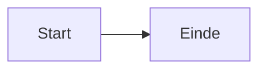

# Clidev - CEDA Slidev Presentaties

Skill voor het maken van Slidev presentaties in de CEDA/Npuls huisstijl. Bouwt voort op `/slidev` voor algemene Slidev-kennis — de regels hier hebben voorrang.

## Projectsetup (altijd als eerste stap)

Voer deze stappen uit in volgorde voordat je een presentatie aanmaakt.

### 1. Controleer of de slidev skill aanwezig is

```bash
ls ~/.claude/skills/slidev/ 2>/dev/null && echo "aanwezig" || echo "niet aanwezig"
```

Als de slidev skill niet aanwezig is, installeer hem eerst:

```bash
npx skills add slidevjs/slidev
```

### 2. Zoek het project op de machine

Zoek naar een directory die de kenmerken heeft van het clidev project — aanwezigheid van `_template.md`, een `theme/` map en een `public/npuls/` structuur:

```bash
find ~ -type f -name "_template.md" 2>/dev/null | xargs -I{} dirname {} | while read dir; do
  [ -d "$dir/theme" ] && [ -d "$dir/public/npuls" ] && echo "$dir"
done | head -3
```

- Als een directory gevonden wordt: gebruik die locatie, ongeacht de naam van de map
- Als niets gevonden wordt: vraag de gebruiker waar het project gekloond mag worden, en gebruik die locatie

```bash
git clone https://github.com/cedanl/clidev-presentaties.git <door-gebruiker-opgegeven-pad>
```

Na navigeren altijd `npm install` draaien als `node_modules/` ontbreekt.

## Quickstart

```bash
cp _template.md YYMMDD_onderwerp.md
npx slidev YYMMDD_onderwerp.md --open
```

Naamconventie: `YYMMDD_onderwerp.md` — bijv. `260311_leeranalytics.md`

## Projectstructuur

```
clidev-presentaties/
├── YYMMDD_onderwerp.md
├── _template.md
├── theme/
└── public/
    ├── npuls/
    │   ├── powerpoint_slides/        # Achtergronden (Slide1-19.PNG)
    │   ├── powerpoint_illustrations/ # SVG-iconen
    │   ├── npuls_logo.jpg
    │   └── Npuls_lettertype/
    ├── ceda_contributors/
    └── presentations/YYMMDD_onderwerp/
```

## Thema

Elke presentatie gebruikt `theme: ./theme`. Hierdoor zijn fonts, kleuren, logo en overlay-verwijdering al geregeld. Geen `<style>` blok nodig in presentatiebestanden.

## Npuls Huisstijl

### Kleuren

| Gebruik | Kleur | Hex |
|---------|-------|-----|
| H1, H2 | Oranje | `#DD784B` |
| H3-H6, body | Zwart | `#000000` |
| Bold, links | Blauw | `#3D68EC` |
| Accenten | Groen, Geel, Roze | `#00AF81`, `#F4D74B`, `#F4D9DC` |

CSS-variabelen: `var(--npuls-blue)`, `var(--npuls-orange)`, `var(--npuls-green)`

**Mermaid-diagrammen:**
- Primaire nodes: `fill:#3D68EC,stroke:#DD784B,color:#fff`
- Belangrijke nodes: `fill:#DD784B,stroke:#3D68EC,color:#fff`
- Succes-nodes: `fill:#00AF81,color:#fff`

### Lettertypen

| Lettertype | Gewicht | Gebruik |
|------------|---------|---------|
| General Sans Regular | 400 | Bodytekst |
| General Sans Semi-Bold | 600 | H1, H2, H3 |
| Cooper Light BT | 300 | Citaten |

Logo verschijnt automatisch rechtsonder via het thema.

## Achtergronden

Gebruik altijd de `` methode. Nooit `background:` in frontmatter.

```html
<div style="position: absolute; top: 0; left: 0; width: 100%; height: 100%; z-index: -1;">
  
</div>
```

| Bestand | Gebruik | Bijzonderheden |
|---------|---------|----------------|
| `Slide1.PNG` | Titelslide | |
| `Slide2.PNG` | Agenda / Over ons | Tekst RECHTS (afbeelding links) |
| `Slide3.PNG` | Standaard contentslide | |
| `Slide4.PNG`–`Slide12.PNG` | Varianten content | Vrij te gebruiken |
| `Slide13.PNG` / `Slide14.PNG` / `Slide15.PNG` | Hoofdstukdividers | Witte tekst verplicht |
| `Slide17.PNG` | Afsluitslide | Geen tekst |

## Centrering

**Titelslide** — gebruik de `.title-center` themaklasse:

```html
<div class="title-center">

# Titel

## Ondertitel

<div class="mt-2 title-subtitle">
<strong>CEDA</strong> - Centre for Educational Data Analytics
</div>
</div>
```

**Content slides** — wikkel content in een gecentreerde flex-wrapper:

```html
<div style="position: absolute; inset: 0; display: flex; flex-direction: column; justify-content: center; padding: 2rem 4rem; z-index: 1;">

# Slidetitel

content hier

</div>
```

**Agenda slide** (Slide2.PNG, tekst rechts):

```html
<div style="margin-left: 50%; padding-left: 2rem; height: 100%; display: flex; flex-direction: column; justify-content: center;">
```

## Illustraties

Controleer exacte bestandsnaam — hoofdlettergevoelig:

```bash
ls public/npuls/powerpoint_illustrations/ | grep -i "zoekwoord"
```

```html

```

## Technische vereisten

Dit zijn de dingen die echt stuk gaan als je ze negeert:

- **Achtergronden**: altijd `` methode, nooit `background:` in frontmatter
- **Hoofdstukslides** (Slide13/14/15): altijd witte tekst (`color: #FFFFFF`)
- **Afsluitslide** (Slide17): geen tekst, alleen achtergrond
- **Agenda slide** (Slide2): content rechts plaatsen, niet links
- **Code highlighting**: `{1|2-3|all}` syntax niet in een `v-click` wrapper — dat breekt de klik-progressie
- **Overflow**: als een slide overloopt, splits je hem op of verklein je de font-size; testen in de browser is de enige manier om dit te zien

### Mermaid

```markdown

```

Houd scale laag (0.5–0.6) en labels kort om overflow te voorkomen.

## Slide layouts in de template

De template bevat werkende voorbeelden van:

- Titelslide
- Agenda (tekst rechts)
- Hoofdstukdivider (witte tekst)
- Content met bullets
- Twee kolommen
- Drie kolommen
- Citaat / highlight
- Code demo
- Tabel
- Illustratie + tekst
- Afsluitslide

Voeg zo veel of zo weinig slides toe als de presentatie vraagt. De template is een startpunt, geen blauwdruk.

## CLI

```bash
npx slidev YYMMDD_onderwerp.md --open     # Dev server (localhost:3030)
npx slidev export YYMMDD_onderwerp.md    # PDF
npx slidev export YYMMDD_onderwerp.md --format pptx
```

Druk op `P` in de browser voor presentatormodus.

## Installatie

```bash
npx skills add cedanl/clidev-presentaties
```

Vereist ook de slidev skill voor basiskennis:

```bash
npx skills add slidevjs/slidev
```
